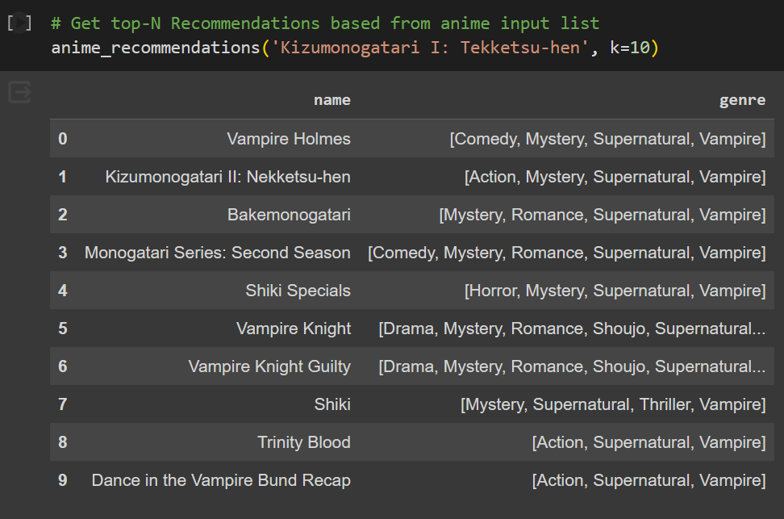
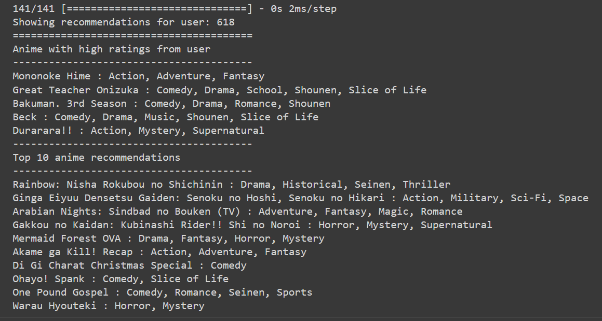

# Anime-Recommender-System

A Project from Dicoding's Machine Learning Expert Class. Recommender System for Anime using Content-Based Filtering and Collaborative Filtering

# Report
The report text is in indonesian which you can see [here](laporan.md)

# Get Started
- open the **anime_recommender_system.ipynb** notebook
- upload your kaggle API (kaggle.json) into colab session storage
- hit "Runtime" and then "Run all"
- in the "Getting top-N Recommendations" section inside "Model Development with Content-Based Filtering" section. Change the name of the anime inside the "anime_recommendation" function.
    > you can use the "anime_input" to check the correct full name of the anime you want to get a recommendation for.
- in the "Getting top-N Recommendations" section inside "Model Development with Collaborative FIltering" section. Simply run the 2 code cells and it will give a recommendation based on a random user inside the dataset.