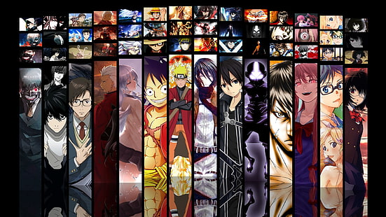
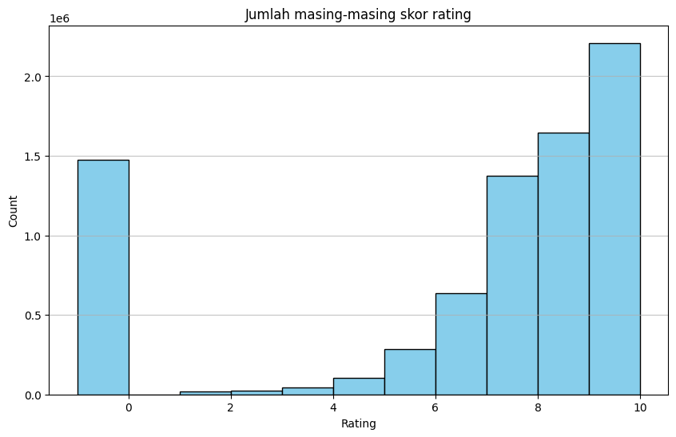
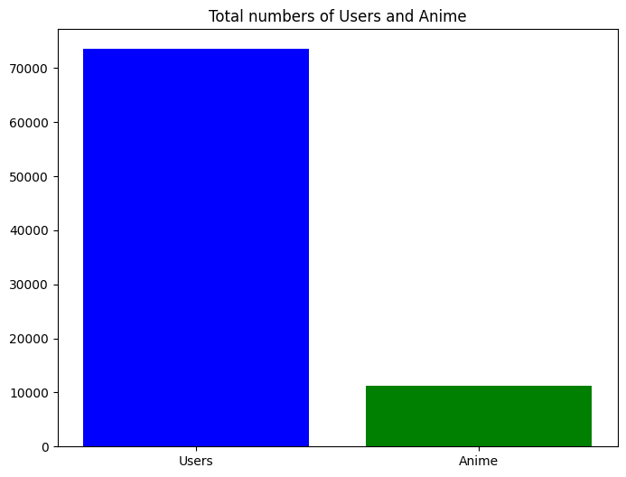
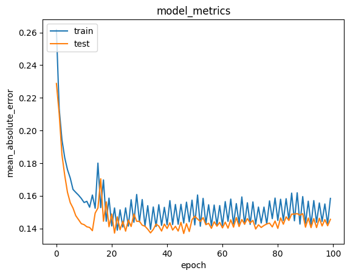

# Machine Learning Project Report - Axel Sean Cahyono Putra

  
Figure 1.0: A collection of popular anime characters

# Anime Recommender System

## Project Overview

In today’s digital era, there is a vast amount of information and entertainment available, such as video games, Hollywood movies, e-books, comics, and, of course, animated films, or **anime**. With so many anime series online, people who are new to anime might feel overwhelmed and confused, especially when trying to find anime that matches their taste[[1]](#1-a-s-girsang1-b-al-faruq1-h-r-herlianto1-and-s-simbolon-collaborative-recommendation-systems-in-users-of-anime-films-journal-of-physics-conference-series-volume-1566-4th-international-conference-on-computing-and-applied-informatics-2019-iccai-2019-26-27-november-2019-medan-indonesia-httpsiopscienceioporgarticle1010881742-659615661012057).

Because people have diverse preferences, anime fans often create communities to discuss anime they’ve watched or ask for recommendations on what to watch next. However, recommendations don’t always align because everyone has different tastes. For example, Person "A" likes anime with **fantasy** and **adventure** themes, while Person "B" prefers **slice-of-life** and **comedy**. Recommendations from Person "B" may not appeal to Person "A".

Therefore, using a machine-learning-based recommendation system can help predict anime recommendations that may suit each person’s taste. One of the most popular recommendation techniques is **Collaborative Filtering**[[1]](#1-a-s-girsang1-b-al-faruq1-h-r-herlianto1-and-s-simbolon-collaborative-recommendation-systems-in-users-of-anime-films-journal-of-physics-conference-series-volume-1566-4th-international-conference-on-computing-and-applied-informatics-2019-iccai-2019-26-27-november-2019-medan-indonesia-httpsiopscienceioporgarticle1010881742-659615661012057).

Streaming platforms like Crunchyroll and Netflix use machine learning recommendation systems to provide users with anime and movies they might enjoy. This enhances the user experience by helping them discover anime that aligns with their preferences. Machine learning recommendation techniques that can be used include **Content-Based Filtering** and **Collaborative Filtering**.

The **Content-Based Filtering** technique recommends products (in this case, anime) that might suit the user based on features of the product itself. For example, if Person "A" enjoys an anime called **"Kizumonogatari I: Tekketsu-hen"** with themes of **Action, Mystery, Vampire**, the system will recommend other anime with similar themes/genres.

Meanwhile, **Collaborative Filtering** recommends products that might suit the user based on their past preferences and the preferences of others with similar tastes. For example, if Person "B" likes **"Fullmetal Alchemist: Brotherhood"** and rates it 8.9/10, and Person "A" has also rated **"Fullmetal Alchemist: Brotherhood"** and **"Kizumonogatari I: Tekketsu-hen"** highly, it can be assumed that Person "B" has similar tastes to Person "A". The system would then recommend **"Kizumonogatari I: Tekketsu-hen"** to Person "B" if they haven’t watched it yet.

## Business Understanding

Successfully providing anime recommendations tailored to each user on an anime streaming platform can lead to increased user engagement and retention. Users are more likely to continue using the platform if the recommended anime aligns with their preferences, which can potentially increase revenue through ads or premium memberships.

### Problem Statement

- How to get anime recommendations with genres similar to the anime the user enjoys.
- How to get recommendations for anime similar to those that have been previously rated.

### Goals

- Provide anime recommendations based on genre or theme, achieving a Recall@K score of over 80%.
- Provide anime recommendations based on previously rated anime with an error rate below 50%.

### Solution Approach

- Use **Content-Based Filtering** to find anime with genres similar to those the user enjoys.
- Use **Collaborative Filtering** to provide anime recommendations based on previously rated anime.

## Data Understanding

The dataset for this project can be downloaded via [this link](https://www.kaggle.com/datasets/CooperUnion/anime-recommendations-database). It includes two files, **anime.csv** and **rating.csv**, which will be loaded into dataframes.

**anime.csv**: Contains data about each anime collected from the site [myanimelist.net](https://myanimelist.net/)  
**rating.csv**: Contains data on the ratings given by each user on [myanimelist.net](https://myanimelist.net/)

### **anime.csv**:

- anime_id: A unique ID from myanimelist.net to identify each anime
- name: The full name of the anime
- genre: The genre(s) of the anime, formatted in CSV (comma-separated values)
- type: The type of anime, e.g., movie, TV, OVA, etc.
- episodes: Number of episodes (1 if it’s a movie)
- rating: The average rating for this anime
- members: The number of community members in the anime’s group

> For the **anime.csv** dataframe, the variables that will be used are **anime_id, name, genre**.

### **rating.csv**:

- user_id: The ID of each user
- anime_id: The ID of the anime watched by the user
- rating: A rating between 1 - 10 given by the user (-1 indicates not yet rated)

### anime.csv Data Information

|   # | Column   | Non-Null Count | Dtype   |
| --: | -------- | -------------- | ------- |
|   0 | anime_id | 12294 non-null | int64   |
|   1 | name     | 12294 non-null | object  |
|   2 | genre    | 12232 non-null | object  |
|   3 | type     | 12269 non-null | object  |
|   4 | episodes | 12294 non-null | object  |
|   5 | rating   | 12064 non-null | float64 |
|   6 | members  | 12294 non-null | int64   |

As shown, the **"anime_id"** column contains 12294 samples. Since **"anime_id"** holds unique IDs, we can conclude that the length of the **anime.csv** dataframe is **12294**.

Example data from **anime.csv**:

|   # | anime_id |                             name |                                               genre |  type | episodes | rating | members |
| --: | -------: | -------------------------------: | --------------------------------------------------: | ----: | -------: | -----: | ------: |
|   0 |    32281 |                   Kimi no Na wa. |                Drama, Romance, School, Supernatural | Movie |        1 |   9.37 |  200630 |
|   1 |     5114 | Fullmetal Alchemist: Brotherhood |  Action, Adventure, Drama, Fantasy, Magic, Military |    TV |       64 |   9.26 |  793665 |
|   2 |    28977 |                         Gintama° | Action, Comedy, Historical, Parody, Samurai, Seinen |    TV |       51 |   9.25 |  114262 |
|   3 |     9253 |                      Steins;Gate |                                    Sci-Fi, Thriller |    TV |       24 |   9.17 |  673572 |
|   4 |     9969 |                    Gintama&#039; | Action, Comedy, Historical, Parody, Samurai, Seinen |    TV |       51 |   9.16 |  151266 |

The **"genre"** column is in CSV format, with genres separated by commas. This makes it challenging for machine learning models to identify each genre present in an anime.

Therefore, determining the genres within this dataframe requires initial cleaning in the [Data Preparation](#data-preparation) phase.

### rating.csv Data Information

This dataset contains 7,813,737 entries and 3 columns.

|   # | Column   | Dtype |
| --: | -------- | ----- |
|   0 | user_id  | int64 |
|   1 | anime_id | int64 |
|   2 | rating   | int64 |

```
print(rating.shape)
--> (7813737, 3)
```

Due to the large number of entries, the dataset will be trimmed to keep the project manageable.

### rating.csv Data Visualization

  
Figure 2.0: Plot of the "rating" column from the "rating" dataframe

The label “count” has a 1e-6 notation above it, meaning the values on this label are multiplied by 1e-6, representing the number of user ratings across various anime. This is why the dataframe contains so many samples.

The "rating" label includes a bar before 0, indicating that many users have given a rating of -1, signifying that they have not yet rated the anime they viewed.

  
Figure 2.1: Plot of the anime_id and user_id columns from the "rating" dataframe

It shows that more than 70,000 unique users have rated over 10,000 unique anime. This data is **many-to-many**, meaning that a single user can rate multiple anime, and a single anime can receive ratings from many users.

## Data Preparation

The data preparation process is divided into two sections: one for the anime dataframe and one for the rating dataframe.

### Anime Data Preparation

#### Converting Anime Genres into a List

- In this step, the genres of each anime in the **anime.csv** dataframe are transformed into arrays (lists). This makes it easier to access individual genres in the "genre" column. The result is as follows:

|   # | anime_id |                             name |                                             genre |  type | episodes | rating | members |
| --: | -------: | -------------------------------: | ------------------------------------------------: | ----: | -------: | -----: | ------: |
|   0 |    32281 |                   Kimi no Na wa. |            [Drama, Romance, School, Supernatural] | Movie |        1 |   9.37 |  200630 |
|   1 |     5114 | Fullmetal Alchemist: Brotherhood | [Action, Adventure, Drama, Fantasy, Magic, Mil... |    TV |       64 |   9.26 |  793665 |
|   2 |    28977 |                         Gintama° | [Action, Comedy, Historical, Parody, Samurai, ... |    TV |       51 |   9.25 |  114262 |
|   3 |     9253 |                      Steins;Gate |                                [Sci-Fi, Thriller] |    TV |       24 |   9.17 |  673572 |
|   4 |     9969 |                    Gintama&#039; | [Action, Comedy, Historical, Parody, Samurai, ... |    TV |       51 |   9.16 |  151266 |

#### Handling Missing Values in the Dataframe

- Rows containing missing values are removed in this step to ensure the dataset is clean, making the machine learning model easier to train.

#### Checking for Unique Genres

- Although this should ideally be done in the [Data Understanding](#data-understanding) section, the previous steps are required to first identify each genre within the anime dataframe.
- The resulting genres are as follows:

```
Total # of genres: 43
List of all genres available: ['Drama', 'Romance', 'School', 'Supernatural', 'Action', 'Adventure', 'Fantasy',
 'Magic', 'Military', 'Shounen', 'Comedy', 'Historical', 'Parody', 'Samurai',
 'Sci-Fi', 'Thriller', 'Sports', 'Super Power', 'Space', 'Slice of Life',
 'Mecha', 'Music', 'Mystery', 'Seinen', 'Martial Arts', 'Vampire', 'Shoujo',
 'Horror', 'Police', 'Psychological', 'Demons', 'Ecchi', 'Josei', 'Shounen Ai',
 'Game', 'Dementia', 'Harem', 'Cars', 'Kids', 'Shoujo Ai', 'Hentai', 'Yaoi', 'Yuri']
```

#### Dropping Unused Columns

- Here, all columns except for **anime_id**, **name**, and **genre** are dropped, as these three columns are sufficient for the **Content-Based Filtering** technique.

#### Removing Adult Content Rows

- This step removes rows containing adult genres such as "Hentai," "Yaoi," "Yuri," etc., to ensure the project provides appropriate recommendations.

#### Converting the Genre List to a String

- The genre lists are converted back into a single string, with each genre separated by a space. Multi-word genres, such as "Martial Arts," are concatenated into a single term ("MartialArts") to facilitate the **TF-IDF Vectorizer** in extracting genre features.

### Rating Data Preparation

#### Reducing Dataframe Size

- The first 1,000,000 entries in the **rating** dataframe are retained to shorten training time and simplify the project.
- After this reduction, there are 1,028 unique users and 5,154 anime rated by those users.

#### Encoding user_id and anime_id

- The **user_id** and **anime_id** columns are encoded and saved into new columns to represent the IDs in a machine-readable format.

#### Converting -1 Ratings to 0

- Ratings of -1, which indicate unrated anime, are converted to 0 for easier processing.

#### Splitting into Training and Validation Sets

- The dataframe is split into training and validation sets in an 80:20 ratio, with the data shuffled before splitting. This ensures the model can evaluate new data effectively and prevents overfitting.

## Modeling and Results

### Content-Based Filtering

**Content-Based Filtering** is a recommendation system technique used to recommend a product that is similar to the products that a user likes. In this case, the system will recommend anime based on genre similarity to the anime that the user likes. This technique uses the **Cosine Similarity** formula to determine the match between one product and another.

The formula for **Cosine Similarity** is:  
$\displaystyle cos~(\theta) = \frac{A \cdot B}{\|A\| \|B\|}$

This technique utilizes the **TF-IDF Vectorizer** model to extract genre information from each anime and convert it into measurable features for similarity. An example is shown below:

|            Name            | thriller |    drama |    mecha | sports | police | fantasy |   action |  romance |   kids | horror |
| :------------------------: | -------: | -------: | -------: | -----: | -----: | ------: | -------: | -------: | -----: | ------ |
| Pororo&#039;s English Show |      0.0 | 0.000000 | 0.000000 |    0.0 |    0.0 |     0.0 | 0.000000 | 0.000000 | 0.6329 | 0.0    |
|   Houkago no Tinker Bell   |      0.0 | 0.357632 | 0.000000 |    0.0 |    0.0 |     0.0 | 0.000000 | 0.404661 | 0.0000 | 0.0    |

In the rows and columns with values greater than 0, it indicates the genres present in the anime.

After that, **Cosine Similarity** will be applied to the cleaned anime dataframe, resulting in the following output:

|                                                                                   name | Umi no Yami, Tsuki no Kage | Kimi no Iru Machi: Tasogare Kousaten | Dragon Nest: Warriors&#039; Dawn | Comic Party Revolution | Kero Kero Keroppi no Sora wo Tobetara | Lupin III vs. Detective Conan | Chi Dor Dor, Chi Dor Dor |  PriPara | Doraemon Movie 21: Nobita no Taiyou Ou Densetsu | Yu☆Gi☆Oh!: Duel Monsters GX |
| -------------------------------------------------------------------------------------: | -------------------------: | -----------------------------------: | -------------------------------: | ---------------------: | ------------------------------------: | ----------------------------: | -----------------------: | -------: | ----------------------------------------------: | --------------------------: |
|                                                                                   name |                            |                                      |                                  |                        |                                       |                               |                          |          |                                                 |                             |
|                                                                                  Life! |                   0.000000 |                             0.000000 |                         0.000000 |               0.285815 |                              0.000000 |                      0.148822 |                 0.000000 | 0.394839 |                                        0.139320 |                    0.134144 |
|                                                         Himitsukessha Taka no Tsume GT |                   0.000000 |                             0.000000 |                         0.000000 |               0.168689 |                              0.000000 |                      0.087835 |                 0.000000 | 0.000000 |                                        0.082227 |                    0.079172 |
| Pokemon Fushigi no Dungeon: Sora no Tankentai - Toki to Yami wo Meguru Saigo no Bouken |                   0.000000 |                             0.000000 |                         0.498222 |               0.000000 |                              0.828993 |                      0.217543 |                 0.623752 | 0.000000 |                                        0.683030 |                    0.205694 |
|                                                    Shijou Saikyou no Deshi Kenichi OVA |                   0.000000 |                             0.444285 |                         0.139403 |               0.149571 |                              0.000000 |                      0.382202 |                 0.000000 | 0.217106 |                                        0.241044 |                    0.344507 |
|                                                                           Yume Utsutsu |                   0.000000 |                             0.000000 |                         0.000000 |               0.000000 |                              0.000000 |                      0.000000 |                 0.000000 | 0.000000 |                                        0.000000 |                    0.000000 |
|                                                          Shakugan no Shana II (Second) |                   0.387967 |                             0.643479 |                         0.301340 |               0.312582 |                              0.000000 |                      0.122624 |                 0.000000 | 0.213459 |                                        0.137592 |                    0.243010 |
|                                                                         Bokura no Hero |                   0.000000 |                             0.000000 |                         0.000000 |               0.000000 |                              0.000000 |                      0.000000 |                 0.000000 | 0.506437 |                                        0.000000 |                    0.000000 |
|                                                                             Moon Pride |                   0.227749 |                             0.231424 |                         0.346933 |               0.000000 |                              0.000000 |                      0.000000 |                 0.000000 | 0.260222 |                                        0.000000 |                    0.000000 |
|                                                               Uchuu Senkan Yamato 2199 |                   0.152858 |                             0.155325 |                         0.123140 |               0.280834 |                              0.000000 |                      0.110170 |                 0.000000 | 0.000000 |                                        0.000000 |                    0.099304 |
|                                                                             Kick-Heart |                   0.291118 |                             0.295815 |                         0.000000 |               0.196537 |                              0.000000 |                      0.102335 |                 0.000000 | 0.000000 |                                        0.095802 |                    0.092242 |

In the table, the similarities between one anime and another can be observed. The values in the table represent the percentage of similarity between the two anime.

#### Getting Top-N Recommendations

The table above is the cosine similarity dataframe that will be used to obtain the top-N anime recommendations. In this case, we will try to get the top-10 recommendations for anime similar to **"Kizumonogatari I: Tekketsu-hen."** The output is as follows:

Data for testing:
| # | name | genre |
|--:|:------------------------------:|:--------------------------------:|
| 0 | Kizumonogatari I: Tekketsu-hen | [Mystery, Supernatural, Vampire] |

Recommendation results:

|   # |               name               |                          genre                           |
| --: | :------------------------------: | :------------------------------------------------------: |
|   0 |          Vampire Holmes          |         [Comedy, Mystery, Supernatural, Vampire]         |
|   1 | Kizumonogatari II: Nekketsu-hen  |         [Action, Mystery, Supernatural, Vampire]         |
|   2 |          Bakemonogatari          |        [Mystery, Romance, Supernatural, Vampire]         |
|   3 | Monogatari Series: Second Season |    [Comedy, Mystery, Romance, Supernatural, Vampire]     |
|   4 |          Shiki Specials          |         [Horror, Mystery, Supernatural, Vampire]         |
|   5 |          Vampire Knight          | [Drama, Mystery, Romance, Shoujo, Supernatural, Vampire] |
|   6 |      Vampire Knight Guilty       | [Drama, Mystery, Romance, Shoujo, Supernatural, Vampire] |
|   7 |              Shiki               |        [Mystery, Supernatural, Thriller, Vampire]        |
|   8 |          Trinity Blood           |             [Action, Supernatural, Vampire]              |
|   9 | Dance in the Vampire Bund Recap  |             [Action, Supernatural, Vampire]              |

Based on the recommendation results, it can be seen that the recommended anime have similar genres to the input anime, which is the "Vampire" genre.

#### Advantages and Disadvantages of Content-Based Filtering

- Advantages:
  1. Does not require data from other users.
  2. Able to recommend new items, as it uses the features of the item itself to recommend items that have not been seen before.
- Disadvantages:
  1. Recommendations are less diverse, as they tend to suggest items similar to the previously liked item.
  2. Cannot capture user preferences that change over time, such as changes in interests or trying new things.

### Collaborative Filtering

**Collaborative Filtering** is a recommendation system technique used to recommend a product based on the similarities of preferences among users. In this case, the system will use highly rated anime by users to find similarities with other users.

This project uses the **RecommenderNet** model created from the **Model** class of **Keras**. The model is then compiled using the metric **Mean Absolute Error**, loss function **Binary Crossentropy**, and optimizer **Adam**. The

training process is carried out on the training data and validated on the validation data with the following configuration:

- Batch size: 256
- Epochs: 5

Once training is complete, the model will be saved as an HDF5 file for future use.

To test the performance of the **Collaborative Filtering** model, we will use the following test data for "Kizumonogatari I: Tekketsu-hen":
| # | name |
|--:|:--------------------------------------:|
| 0 | Kizumonogatari I: Tekketsu-hen |

The recommendation results using the model are as follows:
| # | name | genre |
|--:|:-----------------------------:|:----------------------------:|
| 0 | Vampire Holmes | [Comedy, Mystery, Supernatural, Vampire] |
| 1 | Kizumonogatari II: Nekketsu-hen | [Action, Mystery, Supernatural, Vampire] |
| 2 | Bakemonogatari | [Mystery, Romance, Supernatural, Vampire] |
| 3 | Monogatari Series: Second Season | [Comedy, Mystery, Romance, Supernatural, Vampire] |
| 4 | Shiki Specials | [Horror, Mystery, Supernatural, Vampire] |
| 5 | Vampire Knight | [Drama, Mystery, Romance, Shoujo, Supernatural, Vampire] |
| 6 | Vampire Knight Guilty | [Drama, Mystery, Romance, Shoujo, Supernatural, Vampire] |
| 7 | Shiki | [Mystery, Supernatural, Thriller, Vampire] |
| 8 | Trinity Blood | [Action, Supernatural, Vampire] |
| 9 | Dance in the Vampire Bund Recap | [Action, Supernatural, Vampire] |

Similar to the results of **Content-Based Filtering**, the recommendations provided by **Collaborative Filtering** also focus on the "Vampire" genre.

#### Advantages and Disadvantages of Collaborative Filtering

- Advantages:
  1. Can provide diverse recommendations since it considers the preferences of other users.
  2. Able to capture user preferences over time.
- Disadvantages:
  1. Requires a significant amount of user data to provide accurate recommendations.
  2. New items or items with low ratings may not be recommended because there is not enough data.

## Evaluation

### Evaluasi Content-Based Filtering

Metrik evaluasi yang digunakan untuk **Content Based Filtering** adalah **Recall@K**.

**Recall@K** adalah metrik yang mengukur proporsi dari item yang relevan di top-K dari keseluruhan item relevan di top-N rekomendasi.

Formula dari Recall@K adalah:

Recall@K = $\displaystyle \frac{\text{item yang relevan di top-K}}{\text{item yang relevan di top-N}}$

Berikut analisa Recall@K untuk hasil rekomendasi **Content-Based Filtering**.

Data untuk uji coba
| # | name | genre |
|--:|:------------------------------:|:--------------------------------:|
| 0 | Kizumonogatari I: Tekketsu-hen | [Mystery, Supernatural, Vampire] |

Hasil rekomendasi

|   # |               name               |                          genre                           |
| --: | :------------------------------: | :------------------------------------------------------: |
|   0 |          Vampire Holmes          |         [Comedy, Mystery, Supernatural, Vampire]         |
|   1 | Kizumonogatari II: Nekketsu-hen  |         [Action, Mystery, Supernatural, Vampire]         |
|   2 |          Bakemonogatari          |        [Mystery, Romance, Supernatural, Vampire]         |
|   3 | Monogatari Series: Second Season |    [Comedy, Mystery, Romance, Supernatural, Vampire]     |
|   4 |          Shiki Specials          |         [Horror, Mystery, Supernatural, Vampire]         |
|   5 |          Vampire Knight          | [Drama, Mystery, Romance, Shoujo, Supernatural, Vampire] |
|   6 |      Vampire Knight Guilty       | [Drama, Mystery, Romance, Shoujo, Supernatural, Vampire] |
|   7 |              Shiki               |        [Mystery, Supernatural, Thriller, Vampire]        |
|   8 |          Trinity Blood           |             [Action, Supernatural, Vampire]              |
|   9 | Dance in the Vampire Bund Recap  |             [Action, Supernatural, Vampire]              |

Seperti di tabel, semua anime memiliki ketiga genre di data uji coba yaitu **"Mystery, Supernatural, Vampire"**. Hal ini menjadikan jumlah item yang relevan di top-N = 10. maka dapat disimpulkan juga untuk jumlah item di top-K akan selalu sama dengan K.

Maka Recall@K untuk

- K = 5 &rarr; 5/10 \* 100% = 50%
- K = 8 &rarr; 8/10 \* 100% = 80%
- K = 10 &rarr; 10/10 \* 100% = 100%

Dapat disimpulkan bahwa rekomendasi yang diberikan memiliki Recall@K sebesar 100%.

### Evaluasi Collaborative Filtering

Metrik evaluasi yang digunakan untuk **Collaborative Filtering** adalah **Mean Absolute Error (MAE)**

MAE atau Mean Absolute Error diterapkan dengan cara mengukur rata-rata dari selisih absolut antara prediksi dan nilai asli (y_asli - y_prediksi).

Formula MAE adalah

MAE = $\displaystyle \sum\frac{|y_i - \hat{y}_i|}{n}$

Dimana:
MAE = nilai Mean Absolute Error
y = nilai aktual
ŷ = nilai prediksi
i = urutan data
n = jumlah data

Berikut plot MAE dari model

  
Gambar 3.0 plot MAE dari model

Dapat dilihat model ini memiliki nilai MAE yang relatif rendah yaitu kurang dari 20% dan tidak mengalami overfitting sehingga cocok untuk melakukan prediksi pada data baru.

## Conclusion

Based on the evaluation for **Content-Based Filtering** and **Collaborative Filtering**, the results obtained are quite satisfactory. The anime recommended by both techniques align with the recommendation criteria for each technique.

However, there are still several aspects that need to be developed for this project, namely:

- This project does not yet provide a solution for the **Cold Start** problem, where new users have not rated any anime or indicated their preferred genres.
- The reduction of data in rating.csv is unfortunate because the more data available for collaborative filtering, the more accurate the recommendations can be.
  > An experiment was conducted where the data was reduced to 4,000 samples, and the obtained recommendations remained unchanged (stagnant) for all users, even though the rated anime differed.
- A solution is needed to speed up model training in the **Collaborative Filtering** section when using a large dataset (7,000,000 samples).

In addition, this project has successfully achieved its objectives, which include providing anime recommendations based on the genre or theme of preferred anime and obtaining recommendations based on previously rated anime.

## References

###### [1] A S Girsang1, B Al Faruq1, H R Herlianto1 and S Simbolon, "Collaborative Recommendation Systems in Users of Anime Films" _Journal of Physics: Conference Series, Volume 1566, 4th International Conference on Computing and Applied Informatics 2019 (ICCAI 2019) 26-27 November 2019, Medan, Indonesia_ https://iopscience.iop.org/article/10.1088/1742-6596/1566/1/012057
