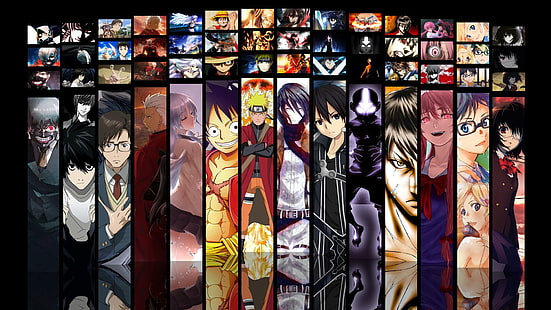
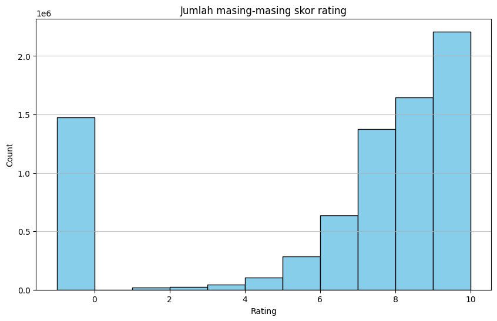
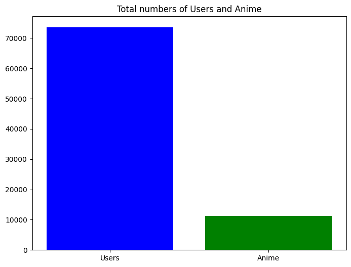
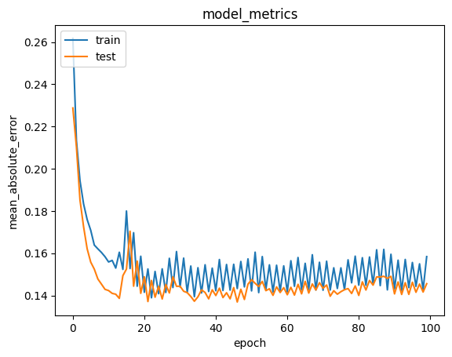

# Machine Learning Project Report - Axel Sean Cahyono Putra

  
Figure 1.0: A collection of popular anime characters

# Anime Recommender System

## Project Overview

Di zaman digital seperti ini tentu banyak informasi dan hiburan yang beredar, contohnya adalah video game, film hollywood, e-book novel atau komik, dan tentu saja film animasi atau bisa disebut **anime**. Karena hal itu ada banyak sekali anime yang beredar di internet dan hal ini dapat membuat orang yang tertarik melihat anime akan kebingungan karena terlalu banyak anime yang mungkin tidak cocok dengan selera mereka[[1]](#1-a-s-girsang1-b-al-faruq1-h-r-herlianto1-and-s-simbolon-collaborative-recommendation-systems-in-users-of-anime-films-journal-of-physics-conference-series-volume-1566-4th-international-conference-on-computing-and-applied-informatics-2019-iccai-2019-26-27-november-2019-medan-indonesia-httpsiopscienceioporgarticle1010881742-659615661012057).

Karena selera yang beragam tentu orang-orang suka membentuk suatu komunitas anime untuk membahas tentang anime yang mereka tonton atau untuk meminta rekomendasi anime untuk ditonton selanjutnya. Namun terkadang rekomendasi yang diberikan tidak selalu cocok karena tiap orang pasti punya selera yang berbeda, contoh orang "A" suka anime dengan tema **fantasy** dan **adventure** lalu meminta rekomendasi ke orang "B" yang suka anime dengan tema **slice-of-life** dan **comedy**, tentu saja rekomendasi dari orang "B" tidak pasti cocok dengan orang "A".

Oleh karena itu penggunaan sistem rekomendasi berbasis machine learning dapat membantu memprediksi rekomendasi anime yang mungkin cocok dengan selera orang masing masing. Salah satu teknik rekomendasi yang paling populer adalah **Collaborative Filtering**[[1]](#1-a-s-girsang1-b-al-faruq1-h-r-herlianto1-and-s-simbolon-collaborative-recommendation-systems-in-users-of-anime-films-journal-of-physics-conference-series-volume-1566-4th-international-conference-on-computing-and-applied-informatics-2019-iccai-2019-26-27-november-2019-medan-indonesia-httpsiopscienceioporgarticle1010881742-659615661012057).

Selain itu platform untuk menonton anime seperti Crunchyroll atau Netflix sudah menggunakan sistem rekomendasi machine learning untuk memberikan rekomendasi film/anime yang mungkin cocok dengan usernya masing masing. Hal ini dilakukan untuk meningkatkan pengalaman pengguna dalam menemukan anime yang sesuai selera mereka. Teknik sistem rekomendasi machine learning yang dapat digunakan diantaranya adalah **Content-Based Filtering** dan **Collaborative Filtering**.

Teknik **Content-Based Filtering** dapat merekomendasikan suatu produk (dalam kasus ini anime) yang mungkin cocok dengan user berdasarkan fitur fitur yang terdapat pada produk tersebut. Contoh, orang "A" suka anime bernama **"Kizumonogatari I: Tekketsu-hen"** dengan genre atau tema **Action, Mystery, Vampire**. Teknik ini akan merekomendasikan anime dengan tema/genre yang sama.

Sedangkan teknik **Collaborative Filtering** dapat merekomendasikan suatu produk yang mungkin cocok dengan user berdasarkan produk yang disukai user itu di masa lalu dan produk yang disukai orang lain dengan selera yang sama. Contoh, orang "B" suka anime bernama **"Fullmetal Alchemist: Brotherhood"** dan orang "B" sudah memberikan rating sebesar 8.9/10. Selain itu orang "A" juga sudah memberikan rating untuk anime **"Fullmetal Alchemist: Brotherhood"** dan **"Kizumonogatari I: Tekketsu-hen"** dengan rating yang juga cukup tinggi. Maka dapat diasumsikan bahwa orang "B" berkemungkinan besar memiliki selera yang sama dengan orang "A". Lalu, sistem akan merekomendasikan anime yang sudah dirating oleh orang "A" yang belum ditonton oleh orang "B", yaitu **"Kizumonogatari I: Tekketsu-hen"**.

## Business Understanding

Dengan keberhasilan memberikan rekomendasi anime yang sesuai untuk tiap user di suatu platform streaming anime. Maka user akan lebih sering menggunakan platform tersebut dan dapat meningkatkan retensi user. Selain itu user juga akan lebih puas jika hasil rekomendasi animenya sesuai dengan preferensi mereka, yang dapat memberikan potensi peningkatan pendapatan berdasarkan iklan atau member premium.

### Problem Statement

- Bagaimana cara mendapatkan rekomendasi anime dengan genre yang mirip dengan anime yang disukai.
- Bagaimana cara medapatkan rekomendasi anime yang mirip dengan anime yang pernah dirating sebelumnya.

### Goals

- Mendapatkan rekomendasi anime berdasarkan genre atau tema dari anime yang disukai dengan tingkat Recall@K lebih dari 80%.
- Mendapatkan rekomendasi anime berdasarkan anime yang pernah dirating sebelumnya dengan error lebih kecil dari 50%.

### Solution Approach

- Menggunakan teknik **Content-Based Filtering** untuk mendapatkan anime dengan genre yang mirip dengan anime yang disukai.
- Menggunakan teknik **Collaborative Filtering** untuk mendapatkan rekomendasi anime berdasarkan anime yang pernah dirating.

## Data Understanding

Dataset untuk proyek ini dapat didownload melalui [link ini](https://www.kaggle.com/datasets/CooperUnion/anime-recommendations-database). Dalam dataset terdapat 2 file yaitu **anime.csv** dan **rating.csv** yang akan diubah menjadi dataframe

**anime.csv**: berisi data tentang tiap anime yang diambil dari situs [myanimelist.net](https://myanimelist.net/)  
**rating.csv**: berisi data tentang rating anime yang diberikan oleh tiap user di situs [myanimelist.net](https://myanimelist.net/)

**anime.csv**:

- anime_id: id unik dari myanimelist.net untuk mengidentifikasi anime
- name: nama lengkap anime
- genre: genre dari anime ini yang ditulis dalam format csv
- type: tipe dari anime. movie, TV, OVA, dll
- episodes: jumlah episode yang dimiliki (1 jika movie)
- rating: rating rata-rata di anime ini
- members: jumlah member komunitas yang ada di group anime ini

> untuk dataframe **anime.csv** variabel yang akan digunakan adalah **anime_id, name, genre**

**rating.csv**:

- user_id: id tiap user
- anime_id: id anime yang ditonton oleh user
- rating: rating 1 - 10 yang diberikan oleh user (-1 artinya belum dirating)

### Info Data anime.csv

|   # | Column   | Non-Null Count | Dtype   |
| --: | -------- | -------------- | ------- |
|   0 | anime_id | 12294 non-null | int64   |
|   1 | name     | 12294 non-null | object  |
|   2 | genre    | 12232 non-null | object  |
|   3 | type     | 12269 non-null | object  |
|   4 | episodes | 12294 non-null | object  |
|   5 | rating   | 12064 non-null | float64 |
|   6 | members  | 12294 non-null | int64   |

Seperti yang terlihat di kolom **"anime_id"** terdapat sampel sejumlah 12294, karena kolom **"anime_id"** berisi id yang unik maka dapat disimpulkan bahwa panjang dataframe **anime.csv** adalah **12294**

Selanjutnya lihat contoh data dalam **anime.csv**

|   # | anime_id |                             name |                                               genre |  type | episodes | rating | members |
| --: | -------: | -------------------------------: | --------------------------------------------------: | ----: | -------: | -----: | ------: |
|   0 |    32281 |                   Kimi no Na wa. |                Drama, Romance, School, Supernatural | Movie |        1 |   9.37 |  200630 |
|   1 |     5114 | Fullmetal Alchemist: Brotherhood |  Action, Adventure, Drama, Fantasy, Magic, Military |    TV |       64 |   9.26 |  793665 |
|   2 |    28977 |                         Gintama° | Action, Comedy, Historical, Parody, Samurai, Seinen |    TV |       51 |   9.25 |  114262 |
|   3 |     9253 |                      Steins;Gate |                                    Sci-Fi, Thriller |    TV |       24 |   9.17 |  673572 |
|   4 |     9969 |                    Gintama&#039; | Action, Comedy, Historical, Parody, Samurai, Seinen |    TV |       51 |   9.16 |  151266 |

Dalam kolom **"genre"** datanya bertipe csv (comma separated value) yang artinya genre-genre itu ditulis dengan koma sebagai pemisah. Hal ini akan membuat model machine learning lebih sulit dalam mengidentifikasi masing masing genre yang terdapat dalam suatu anime.

Karena hal tersebut, mengetahui genre apa saja yang ada dalam dataframe tersebut akan sulit. Dataframe ini perlu dibersihkan terlebih dahulu di tahap [Data Preparation](#data-preparation)

### Info Data rating.csv

Dataset ini mengandung 7813737 entri dan 3 kolom

|   # | Column   | Dtype |
| --: | -------- | ----- |
|   0 | user_id  | int64 |
|   1 | anime_id | int64 |
|   2 | rating   | int64 |

```
print(rating.shape)
--> (7813737, 3)
```

Karena jumlahnya yang banyak maka ukurannya akan dikurangi demi menjaga kesimpelan proyek ini

### Visualisasi Data rating.csv

  
Gambar 2.0 plot kolom rating dari dataframe "rating"

Di label "count" terdapat angka 1e-6 di atas sendiri, nilai nilai di label itu akan dikali 1e-6, artinya banyak rating dari user di berbagai macam anime. Hal ini lah yang membuat dataframe berisi banyak sampel

Di label "rating" terdapat bar sebelum di angka 0 yang artinya banyak user yang memberi rating -1 karena masih belum memberikan rating terhadap anime yang dilihat.

  
Gambar 2.1 plot kolom anime_id dan user_id dari dataframe "rating"

Terlhat jumlah user unik yang memberi rating lebih dari 70000 dan jumlah anime unik yang diberi rating lebih dari 10000. Data ini bersifat **many-to-many** yang berarti bahwa 1 user bisa memberi rating ke banyak anime dan 1 anime bisa diberi rating oleh banyak user

## Data Preparation

Tahap data preparation dipisah menjai 2 yaitu untuk dataframe anime dan dataframe rating

### Anime Data Preparation

#### Konversi genre dari setiap anime menjadi list

- Pada tahap ini genre dari setiap anime di dataframe **anime.csv** akan diubah menjadi bentuk array(list). Hal ini dilakukan untuk mempermudah akses ke genre di kolom "genre". Hasilnya sebagai berikut

|   # | anime_id |                             name |                                             genre |  type | episodes | rating | members |
| --: | -------: | -------------------------------: | ------------------------------------------------: | ----: | -------: | -----: | ------: |
|   0 |    32281 |                   Kimi no Na wa. |            [Drama, Romance, School, Supernatural] | Movie |        1 |   9.37 |  200630 |
|   1 |     5114 | Fullmetal Alchemist: Brotherhood | [Action, Adventure, Drama, Fantasy, Magic, Mil... |    TV |       64 |   9.26 |  793665 |
|   2 |    28977 |                         Gintama° | [Action, Comedy, Historical, Parody, Samurai, ... |    TV |       51 |   9.25 |  114262 |
|   3 |     9253 |                      Steins;Gate |                                [Sci-Fi, Thriller] |    TV |       24 |   9.17 |  673572 |
|   4 |     9969 |                    Gintama&#039; | [Action, Comedy, Historical, Parody, Samurai, ... |    TV |       51 |   9.16 |  151266 |

#### Mengatasi missing value pada dataframe

- Pada tahap ini dilakukan pengedropan baris yang memiliki missing value. Hal ini dilakukan untuk membersihkan data supaya model machine learning bisa lebih mudah melakukan proses pelatihan.

#### Cek genre unik

- Tahap ini seharusnya dilakukan di bagian [Data Understanding](#data-understanding) namun karena kedua tahap diatas perlu dijalankan terlebih dahulu sebelum bisa mengidentifikasi tiap genre yang terdapat dalam dataframe anime.
- Genre yang didapat adalah:

```
Total # of genre:  43
List of all genre available:  ['Drama' 'Romance' 'School' 'Supernatural' 'Action' 'Adventure' 'Fantasy'
 'Magic' 'Military' 'Shounen' 'Comedy' 'Historical' 'Parody' 'Samurai'
 'Sci-Fi' 'Thriller' 'Sports' 'Super Power' 'Space' 'Slice of Life'
 'Mecha' 'Music' 'Mystery' 'Seinen' 'Martial Arts' 'Vampire' 'Shoujo'
 'Horror' 'Police' 'Psychological' 'Demons' 'Ecchi' 'Josei' 'Shounen Ai'
 'Game' 'Dementia' 'Harem' 'Cars' 'Kids' 'Shoujo Ai' 'Hentai' 'Yaoi'
 'Yuri']

```

#### Drop kolom yang tidak digunakan

- Pada tahap ini kolom selain anime_id, name, dan genre akan di drop. Karena ke 3 kolom itu sudah cukup untuk teknik **Content-Based Filtering**.

#### Drop baris dengan genre "dewasa"

- Pada tahap ini baris genre dewasa seperti "Hentai", "Yaoi", "Yuri", dll akan di drop. Demi menjaga penggunaan proyek ini untuk rekomendasi yang tidak senonoh.

#### Mengubah list genre menjadi string

- Pada tahap ini list genre diubah lagi menjadi string dengan spasi sebagai pemisah dan dimasukkan ke kolom baru, sudah dilakukan pencegahan untuk genre 2 kata seperti "Martial Arts" ketika diubah menjadi string maka spasi akan dihilangkan menjadi "MartialArts". Hal ini dilakukan untuk mempermudah **TF-IDF Vectorizer** dalam mendapatkan fitur genre.

### Rating Data Preparation

#### Mengurangi ukuran dataframe

- Pada tahap ini akan diambil 1000000 data pertama di dataframe rating. Hal ini dilakukan supaya proses training tidak terlalu lama dan menjaga kesimpelan proyek.
- Setelah dikurangi terdapat 1028 jumlah user dan 5154 jumlah anime yang diberi rating oleh user

#### Encoding user_id dan anime_id

- Pada tahap ini dilakukan proses encoding pada kolom user_id dan anime_id dan dimasukkan ke kolom baru masing-masing. Hal ini dilakukan untuk merepresentasikan id user dan anime dalam format yang dapat di proses oleh model machine learning.

#### Mengubah rating -1 menjadi 0

- Rating yang bernilai -1 akan diubah menjadi 0 untuk mempermudah pemrosesan

#### Split menjadi data train dan validasi

- Melakukan pemisahan pada dataframe menjadi train dan validasi dengan rasio 80:20, namun data di acak terlebih dahulu sebelum di pisah. Hal ini dilakukan supaya model dapat melakukan evaluasi pada data baru dan mencegah overfitting

## Modelling and Result

### Content-Based Filtering

Teknik **Content-Based Filtering** merupakan teknik sistem rekomendasi untuk merekomendasikan suatu produk yang memiliki kemiripan dengan produk yang disukai. Dalam kasus ini sistem akan merekomendasikan anime berdasarkan kemiripan genre dengan anime yang disukai pengguna. Teknik ini menggunakan rumus **Cosine Similarity** untuk mendapatkan kecocokan antara produk 1 dengan yang lain.

Formula untuk **Cosine Similarity** adalah:  
$\displaystyle cos~(\theta) = \frac{A \cdot B}{\|A\| \|B\|}$

Teknik ini menggunakan model **TF-IDF Vectorizer** untuk mendapatkan informasi mengenai genre yang terdapat di setiap anime dan diubah menjadi fitur yang dapat diukur kemiripannya. Contohnya adalah sebagai berikut

|                        Name                        | thriller |    drama |    mecha | sports | police | fantasy |   action |  romance |   kids | horror |
| :------------------------------------------------: | -------: | -------: | -------: | -----: | -----: | ------: | -------: | -------: | -----: | ------ |
|             Pororo&#039;s English Show             |      0.0 | 0.000000 | 0.000000 |    0.0 |    0.0 |     0.0 | 0.000000 | 0.000000 | 0.6329 | 0.0    |
|               Houkago no Tinker Bell               |      0.0 | 0.357632 | 0.000000 |    0.0 |    0.0 |     0.0 | 0.000000 | 0.404661 | 0.0000 | 0.0    |
|                       Piano                        |      0.0 | 0.367787 | 0.000000 |    0.0 |    0.0 |     0.0 | 0.000000 | 0.416152 | 0.0000 | 0.0    |
|                  Hokuto no Ken 2                   |      0.0 | 0.376239 | 0.000000 |    0.0 |    0.0 |     0.0 | 0.326572 | 0.000000 | 0.0000 | 0.0    |
| Top wo Nerae! &amp; Top wo Nerae 2! Gattai Movie!! |      0.0 | 0.000000 | 0.710943 |    0.0 |    0.0 |     0.0 | 0.000000 | 0.000000 | 0.0000 | 0.0    |

Pada baris dan kolom yang memiliki angka lebih dari 0 menunjukan genre yang ada pada anime tersebut.

Setelah itu **Cosine Similarity** akan diterapkan pada dataframe anime yang telah dibersihkan sehingga menghasilkan output sebagai berikut:

|                                                                                   name | Umi no Yami, Tsuki no Kage | Kimi no Iru Machi: Tasogare Kousaten | Dragon Nest: Warriors&#039; Dawn | Comic Party Revolution | Kero Kero Keroppi no Sora wo Tobetara | Lupin III vs. Detective Conan | Chi Dor Dor, Chi Dor Dor |  PriPara | Doraemon Movie 21: Nobita no Taiyou Ou Densetsu | Yu☆Gi☆Oh!: Duel Monsters GX |
| -------------------------------------------------------------------------------------: | -------------------------: | -----------------------------------: | -------------------------------: | ---------------------: | ------------------------------------: | ----------------------------: | -----------------------: | -------: | ----------------------------------------------: | --------------------------: |
|                                                                                   name |                            |                                      |                                  |                        |                                       |                               |                          |          |                                                 |                             |
|                                                                                  Life! |                   0.000000 |                             0.000000 |                         0.000000 |               0.285815 |                              0.000000 |                      0.148822 |                 0.000000 | 0.394839 |                                        0.139320 |                    0.134144 |
|                                                         Himitsukessha Taka no Tsume GT |                   0.000000 |                             0.000000 |                         0.000000 |               0.168689 |                              0.000000 |                      0.087835 |                 0.000000 | 0.000000 |                                        0.082227 |                    0.079172 |
| Pokemon Fushigi no Dungeon: Sora no Tankentai - Toki to Yami wo Meguru Saigo no Bouken |                   0.000000 |                             0.000000 |                         0.498222 |               0.000000 |                              0.828993 |                      0.217543 |                 0.623752 | 0.000000 |                                        0.683030 |                    0.205694 |
|                                                    Shijou Saikyou no Deshi Kenichi OVA |                   0.000000 |                             0.444285 |                         0.139403 |               0.149571 |                              0.000000 |                      0.382202 |                 0.000000 | 0.217106 |                                        0.241044 |                    0.344507 |
|                                                                           Yume Utsutsu |                   0.000000 |                             0.000000 |                         0.000000 |               0.000000 |                              0.000000 |                      0.000000 |                 0.000000 | 0.000000 |                                        0.000000 |                    0.000000 |
|                                                          Shakugan no Shana II (Second) |                   0.387967 |                             0.643479 |                         0.301340 |               0.312582 |                              0.000000 |                      0.122624 |                 0.000000 | 0.213459 |                                        0.137592 |                    0.243010 |
|                                                                         Bokura no Hero |                   0.000000 |                             0.000000 |                         0.000000 |               0.000000 |                              0.000000 |                      0.000000 |                 0.000000 | 0.506437 |                                        0.000000 |                    0.000000 |
|                                                                             Moon Pride |                   0.227749 |                             0.231424 |                         0.346933 |               0.000000 |                              0.000000 |                      0.000000 |                 0.000000 | 0.260222 |                                        0.000000 |                    0.000000 |
|                                                               Uchuu Senkan Yamato 2199 |                   0.152858 |                             0.155325 |                         0.123140 |               0.280834 |                              0.000000 |                      0.110170 |                 0.000000 | 0.000000 |                                        0.000000 |                    0.099304 |
|                                                                             Kick-Heart |                   0.291118 |                             0.295815 |                         0.000000 |               0.196537 |                              0.000000 |                      0.102335 |                 0.000000 | 0.000000 |                                        0.095802 |                    0.092242 |

Di tabel tersebut dapat dilihat kecocokan dari 1 anime dengan yang lain. Nilai-nilai pada tabel tersebut merepresentasikan persentase kecocokan antara kedua anime tersebut.

#### Mendapatkan top-N rekomendasi

Tabel tersebut adalah dataframe cosine similarity yang akan digunakan untuk mendapatkan top-N rekomendasi anime. Dalam kasus ini akan dicoba mendapatkan top-10 rekomendasi anime yang mirip dengan anime **"Kizumonogatari I: Tekketsu-hen"**. Outputnya sebagai berikut

Data untuk uji coba
| # | name | genre |
|--:|:------------------------------:|:--------------------------------:|
| 0 | Kizumonogatari I: Tekketsu-hen | [Mystery, Supernatural, Vampire] |

Hasil rekomendasi

|   # |               name               |                          genre                           |
| --: | :------------------------------: | :------------------------------------------------------: |
|   0 |          Vampire Holmes          |         [Comedy, Mystery, Supernatural, Vampire]         |
|   1 | Kizumonogatari II: Nekketsu-hen  |         [Action, Mystery, Supernatural, Vampire]         |
|   2 |          Bakemonogatari          |        [Mystery, Romance, Supernatural, Vampire]         |
|   3 | Monogatari Series: Second Season |    [Comedy, Mystery, Romance, Supernatural, Vampire]     |
|   4 |          Shiki Specials          |         [Horror, Mystery, Supernatural, Vampire]         |
|   5 |          Vampire Knight          | [Drama, Mystery, Romance, Shoujo, Supernatural, Vampire] |
|   6 |      Vampire Knight Guilty       | [Drama, Mystery, Romance, Shoujo, Supernatural, Vampire] |
|   7 |              Shiki               |        [Mystery, Supernatural, Thriller, Vampire]        |
|   8 |          Trinity Blood           |             [Action, Supernatural, Vampire]              |
|   9 | Dance in the Vampire Bund Recap  |             [Action, Supernatural, Vampire]              |

Berdasarkan hasil rekomendasi tersebut dapat dilihat bahwa anime yang direkomendasikan memiliki genre yang mirip dengan input animenya yaitu genre "Vampire".

#### Kelebihan dan Kekurangan Content-Based Filtering

- Kelebihan:
  1. Tidak memerlukan data user lain
  2. Mampu merekomendasikan item baru, karena menggunakan fitur-fitur dari item itu sendiri yang dapat digunakan untuk memberikan rekomendasi item yang belum pernah dilihat sebelumnya
- Kekurangan:
  1. Rekomendasi kurang beragam, karena cenderung memberi rekomendasi yang mirip dengan item yang disukai sebelumnya
  2. Tidak mampu menangkap preferensi user yang berubah ubah, seperti perubahan minat atau mencoba hal baru.

### Collaborative Filtering

Teknik **Collaborative Filtering** merupakan teknik sistem rekomendasi untuk merekomendasikan suatu produk berdasarkan kesamaan preferensi antar user. Dalam kasus ini sistem akan menggunakan anime yang dirating tinggi oleh user untuk mencari kesamaan dengan user lain.

Proyek ini menggunakan model **RecommenderNet** yang dibuat dari kelas **Model** milik **Keras**. Dan kemudian dicompile menggunakan metrik **Mean Absolute Error**, loss function **Binary Crossentropy**, dan optimizer **Adam**. Dan kemudian model dapat dilatih.

#### Mendapatkan top-N rekomendasi

Pertama ambil dulu user secara acak dari dataframe rating. Kemudian tunjukkan anime anime yang telah dirating oleh user tersebut.

```
Showing recommendations for user: 618
========================================
Anime with high ratings from user
----------------------------------------
Mononoke Hime : Action, Adventure, Fantasy
Great Teacher Onizuka : Comedy, Drama, School, Shounen, Slice of Life
Bakuman. 3rd Season : Comedy, Drama, Romance, Shounen
Beck : Comedy, Drama, Music, Shounen, Slice of Life
Durarara!! : Action, Mystery, Supernatural
----------------------------------------
```

Kemudian akan diambil semua anime yang belum dilihat oleh user, lalu model akan melakukan prediksi berdasarkan anime dengan rating tinggi oleh user dan kemiripannya dengan user lain. Hasilnya akan mendapatkan rekomendasi sebagai berikut

```
Top 10 anime recommendations
----------------------------------------
Rainbow: Nisha Rokubou no Shichinin : Drama, Historical, Seinen, Thriller
Ginga Eiyuu Densetsu Gaiden: Senoku no Hoshi, Senoku no Hikari : Action, Military, Sci-Fi, Space
Arabian Nights: Sindbad no Bouken (TV) : Adventure, Fantasy, Magic, Romance
Gakkou no Kaidan: Kubinashi Rider!! Shi no Noroi : Horror, Mystery, Supernatural
Mermaid Forest OVA : Drama, Fantasy, Horror, Mystery
Akame ga Kill! Recap : Action, Adventure, Fantasy
Di Gi Charat Christmas Special : Comedy
Ohayo! Spank : Comedy, Slice of Life
One Pound Gospel : Comedy, Romance, Seinen, Sports
Warau Hyouteki : Horror, Mystery
```

Terlihat bahwa hasil rekomendasi menunjukkan anime yang relevan dengan anime yang telah dirating sebelumnya. Rekomendasi yang diberikan juga bervariasi dan tidak hanya terpatok pada beberapa genre tertentu tidak seperti **Content-Based Filtering**.

#### Kelebihan dan Kekurangan

- Kelebihan:
  1. Mampu memberikan rekomendasi yang lebih personal, karena preferensi dapat dilihat dari rating yang diberikan.
  2. Dapat menangkap preferensi user yang kompleks
- Kekurangan:
  1. Memerlukan data yang banyak untuk dapat memberikan rekomendasi yang akurat
  2. Mudah terpengaruh efek popularitas yang dapat mengabaikan preferensi pengguna

## Evaluation

### Evaluasi Content-Based Filtering

Metrik evaluasi yang digunakan untuk **Content Based Filtering** adalah **Recall@K**.

**Recall@K** adalah metrik yang mengukur proporsi dari item yang relevan di top-K dari keseluruhan item relevan di top-N rekomendasi.

Formula dari Recall@K adalah:

Recall@K = $\displaystyle \frac{\text{item yang relevan di top-K}}{\text{item yang relevan di top-N}}$

Berikut analisa Recall@K untuk hasil rekomendasi **Content-Based Filtering**.

Data untuk uji coba
| # | name | genre |
|--:|:------------------------------:|:--------------------------------:|
| 0 | Kizumonogatari I: Tekketsu-hen | [Mystery, Supernatural, Vampire] |

Hasil rekomendasi

|   # |               name               |                          genre                           |
| --: | :------------------------------: | :------------------------------------------------------: |
|   0 |          Vampire Holmes          |         [Comedy, Mystery, Supernatural, Vampire]         |
|   1 | Kizumonogatari II: Nekketsu-hen  |         [Action, Mystery, Supernatural, Vampire]         |
|   2 |          Bakemonogatari          |        [Mystery, Romance, Supernatural, Vampire]         |
|   3 | Monogatari Series: Second Season |    [Comedy, Mystery, Romance, Supernatural, Vampire]     |
|   4 |          Shiki Specials          |         [Horror, Mystery, Supernatural, Vampire]         |
|   5 |          Vampire Knight          | [Drama, Mystery, Romance, Shoujo, Supernatural, Vampire] |
|   6 |      Vampire Knight Guilty       | [Drama, Mystery, Romance, Shoujo, Supernatural, Vampire] |
|   7 |              Shiki               |        [Mystery, Supernatural, Thriller, Vampire]        |
|   8 |          Trinity Blood           |             [Action, Supernatural, Vampire]              |
|   9 | Dance in the Vampire Bund Recap  |             [Action, Supernatural, Vampire]              |

Seperti di tabel, semua anime memiliki ketiga genre di data uji coba yaitu **"Mystery, Supernatural, Vampire"**. Hal ini menjadikan jumlah item yang relevan di top-N = 10. maka dapat disimpulkan juga untuk jumlah item di top-K akan selalu sama dengan K.

Maka Recall@K untuk

- K = 5 &rarr; 5/10 \* 100% = 50%
- K = 8 &rarr; 8/10 \* 100% = 80%
- K = 10 &rarr; 10/10 \* 100% = 100%

Dapat disimpulkan bahwa rekomendasi yang diberikan memiliki Recall@K sebesar 100%.

### Evaluasi Collaborative Filtering

Metrik evaluasi yang digunakan untuk **Collaborative Filtering** adalah **Mean Absolute Error (MAE)**

MAE atau Mean Absolute Error diterapkan dengan cara mengukur rata-rata dari selisih absolut antara prediksi dan nilai asli (y_asli - y_prediksi).

Formula MAE adalah

MAE = $\displaystyle \sum\frac{|y_i - \hat{y}_i|}{n}$

Dimana:
MAE = nilai Mean Absolute Error
y = nilai aktual
ŷ = nilai prediksi
i = urutan data
n = jumlah data

Berikut plot MAE dari model

  
Gambar 3.0 plot MAE dari model

Dapat dilihat model ini memiliki nilai MAE yang relatif rendah yaitu kurang dari 20% dan tidak mengalami overfitting sehingga cocok untuk melakukan prediksi pada data baru.

## Conclusion

Berdasarkan evaluasi untuk **Content-Based Filtering** dan **Collaborative Filtering** hasil yang didapat sudah cukup memuaskan. Karena anime yang direkomendasikan dari kedua teknik tersebut sesuai dengan ketentuan rekomendasi untuk teknik masing-masing.

Namun masih terdapat beberapa hal yang masih perlu dikembangkan untuk proyek ini, yaitu

- Proyek ini masih belum memberikan solusi untuk kasus **Cold Start**. Dimana user baru belum memiliki rating anime maupun jenis anime yang disukai.
- Pengurangan data pada rating.csv sangat disayangkan karena semakin banyak data untuk collaborative filtering maka rekomendasi yang diberikan bisa lebih akurat.
  > telah dilakukan percobaan dimana data dikurangi menjadi 4000 sampel dan hasil rekomendasi yang didapatkan tidak berubah (stagnan) untuk semua user meskipun anime yang dirating berbeda.
- Dibutuhkan solusi untuk mempercepat pelatihan model pada bagian **Collaborative Filtering** dalam melakukan pelatihan menggunakan dataset yang besar (7000000 sampel).

Selain itu proyek ini telah berhasil mencapai tujuan yang ditetapkan yaitu mendapatkan rekomendasi anime berdasarkan genre atau tema dari anime yang disukai dan mendapatkan rekomendasi anime berdasarkan anime yang pernah dirating sebelumnya.

## References

###### [1] A S Girsang1, B Al Faruq1, H R Herlianto1 and S Simbolon, "Collaborative Recommendation Systems in Users of Anime Films" _Journal of Physics: Conference Series, Volume 1566, 4th International Conference on Computing and Applied Informatics 2019 (ICCAI 2019) 26-27 November 2019, Medan, Indonesia_ https://iopscience.iop.org/article/10.1088/1742-6596/1566/1/012057
